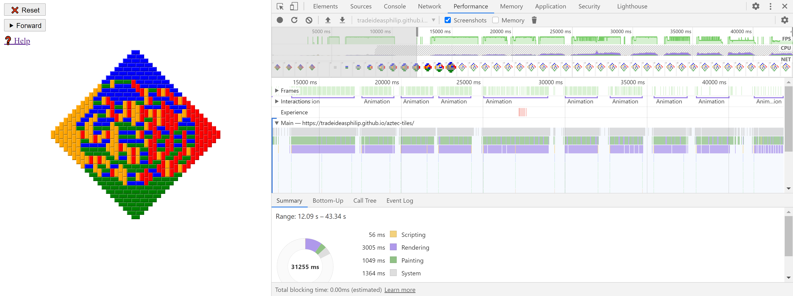

# aztec-tiles
Based on the video [The ARCTIC CIRCLE THEOREM or Why do physicists play dominoes?](https://www.youtube.com/watch?v=Yy7Q8IWNfHM) by Mathologer.

Only tested on Chrome.  Should work on other browsers.

Run from here:  https://tradeideasphilip.github.io/aztec-tiles/

## Performance
This program slows down sooner than I'd like.
I ran the profiler and Chrome spends most of its time rendering and painting.

That's interesting.
I wrote this code quickly and there were several spots that I wanted to optimize.
But the problem isn't in my algorithms.
I need to change the way I organize the GUI, not the JavaScript.
I'm glad I checked.
I never would have guessed.
